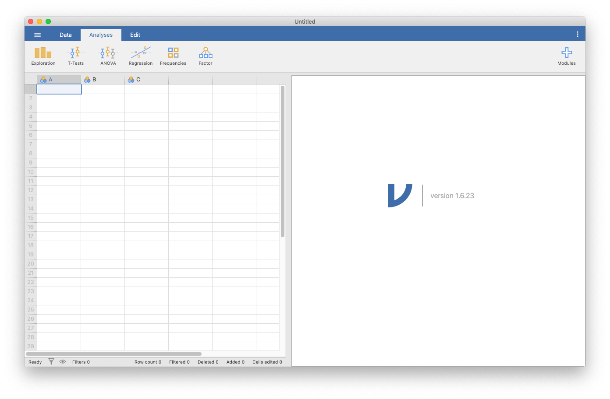
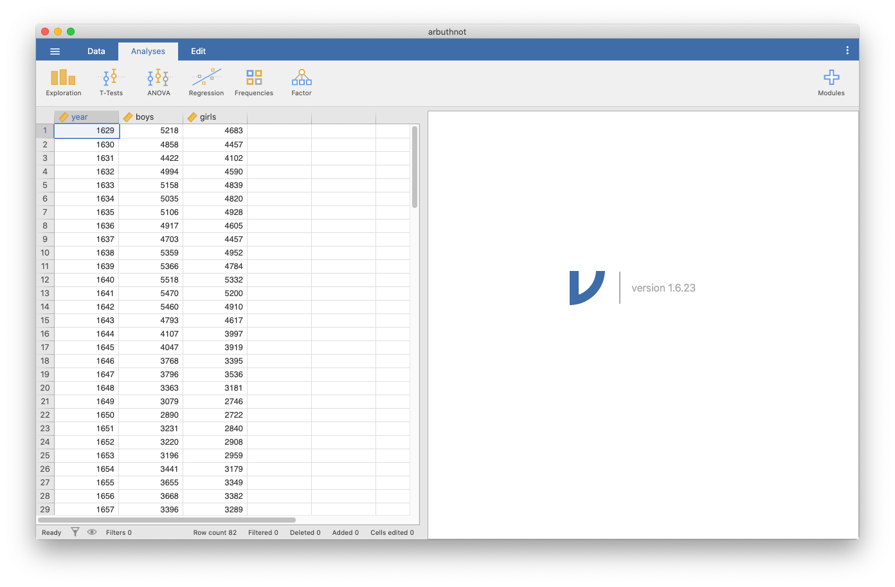

```{r global_options, include = FALSE}
knitr::opts_chunk$set(eval = TRUE, results = FALSE)
library(tidyverse)
library(openintro)
```

## The jamovi Interface

The goal of this lab is to introduce you to jamovi, which you'll be using throughout the course both to learn the statistical concepts discussed in the course and to analyze real data and come to informed conclusions.

As the labs progress, you are encouraged to explore beyond what the labs dictate; a willingness to experiment will make you a much better data analyst! Before we get to that stage, however, you need to build some basic fluency with jamovi. First, we will explore the fundamental building blocks of jamovi, reading in data, and basic commands for working with data in jamovi.

You can download jamovi from https://www.jamovi.org/. Click `jamovi Desktop` box near the top of the screen, then select the version from the computer you are using.

Go ahead and launch jamovi. You should see a window that looks like the image shown below.

```{r r-interface-2020, echo=FALSE, results="asis"}

```

### Loading data

First we're going to download a dataset. This data will be downloaded from https://www.openintro.org/data/index.php?data=arbuthnot. Open this window, then select the CSV file to download it to your computer. You may need to right click or control-click then select `save file as` in order to download the file instead of viewing it, depending on your operating system and particular web browser. Make sure to note where you download it, since we'll need to go to that location to load it.

To load the data, click the menu button at the top left part of the window (with the three horizontal lines), then `Open`, then `Browse`, and select the file in the location you downloaded it to. You will see a new window open with a display of the data, which should look like this:

```{r loaded-data, echo=FALSE, results="asis"}

```

You'll see three columns, one for each variable in the data. This display should feel similar to viewing data in Excel, where you are able to scroll through the dataset to inspect it. You can double click the data to change any data that needs fixing, but we don't need to do that.

## Dr. Arbuthnot's Baptism Records

Let's take a peek at the data. The Arbuthnot data set refers to the work of Dr. John Arbuthnot, an 18<sup>th</sup> century physician, writer, and mathematician. He was interested in the ratio of newborn boys to newborn girls, so he gathered the baptism records for children born in London for every year from 1629 to 1710.

We can see that there are 82 observations and 3 variables in this dataset. The variable names are `year`, `boys`, and `girls`.

When inspecting the data, you should see three columns of numbers and 82 rows. Each row represents a different year that Arbuthnot collected data. There is also a column to the left of the variables which shows a row number. The first variable is the year, and the second and thirds are the numbers of boys and girls baptized that year, respectively. Use the scrollbar on the right side of the window to examine the complete data set.

Note that the row numbers are not part of Arbuthnot's data. jamovi adds these row numbers as part of its printout to help you make visual comparisons. You can think of them as the index that you see on the left side of a spreadsheet. In fact, the comparison of the data to a spreadsheet will generally be helpful.

### Types of Variables

Just to the left of the name of each variable, you should see an icon of a ruler. If you double click the variable name, you will see options for the variable. This allows you to specify whether jamovi should interpret the varaible as a continuous, ordinal, or nominal variable (or an ID). jamovi will try to select the correct type when it loads the data. We will leave these variables as continuous. You can click the upward pointed arrow button to close this menu.

## Some exploration

Let's start to examine the data a little more closely. Click the `Exploration` button near the top of the window, then click `Descriptives`. You will see the list of variables in one box. We can move the variable `boys` to the box labeled `Variables` to see some descriptive statistics for that variable. You can move the variable over by clicking and dragging the variable name or by clicking the variable name and then clicking the arrow between the boxes pointed at the `Variables` box.

You will then see the results in the right hand side of the window. You should see that there are 82 valid observations, no data is missing, and you will see various other descriptive statistics for that variable. You can add an additional variable to the `Variables` box, and you will then see descriptives for each variable in the box. Do this with `girls` to see how the two variables compare.

1.  How many valid observations are there for the variables `girls`? Are any values missing?

### Creating a jamovi file

Now that we have some analysis, we should save our file in case we want to come back to it. With jamovi, you can save a `.omv` file which contains your data and all of your analysis, along with any descriptions you write in yourself. Open the menu, select `Save As` and you can save your first jamovi file to your computer.

### Data visualization

In order to create a scatterplot in jamovi, we will add a module. This extends the capabilities of jamovi. Click the plus button at the top right part of the screen, select `jamovi library`, then click `INSTALL` in the first option, `scatr`. Click the up arrow to close this menu, then when you click `Exploration`, again, there will be new options. Click `Scatterplot` in the `Exploration` menu.

To create a simple plot of the number of girls baptized per year, we will start by selecting the variables we are interested in. Move the variable `year` to the `X-Axis` option and `girls` to the `Y-Axis` option (either by clicking and dragging or by using the arrow buttons). You will immediately see the scatterplot in the right panel.

jamovi allows for a number of features to be added to the scatter plot. We can turn on a density plot or a boxplot for each variable using the radio buttons below `Marginals`, or add regression lines using the radio buttons below `Regression Line`.

Use the plot to address the following question:

1.  Is there an apparent trend in the number of girls baptized over the years? How would you describe it?

## Analysis options

Within your results, you can change the names of sections and add comments. Double click the word `Descriptives` above your table of results, and you can change this to another name. By clicking below this name, you can add comments, and you can add comments by clicking below the table. By clicking the different sections of your analysis, you can bring up the menu of each section. By adding text, you can make a comprehensive document of all of your statistical work.

Next, by right clicking on an analysis, you can duplicate an analysis, in case you want to run two similar analyses.

### Adding a new variable to the data frame

We are interested in using a new vector of the total number of baptisms to generate some plots, so we'll want to add it as a column in our data.

Close the analysis view to go back to viewing the data. Double click the header (where the name of a variable would be) in the fourth column, where we will create the new variable. This will bring up a menu: click `NEW COMPUTED VARIABLE`.

Change the name of the variable to `total`, then click the button labeled $f_x$. This will bring up a menu for us to enter the formula for the new variable. You can click the name of a variable to include it in the formula. In formula, enter `boys+girls`. You'll see that there is now a new column called `total` that has been tacked onto the data.

1. Create a scatterplot of the total number of baptisms per year.

In a similar fashion, once you know the total number of baptisms for boys and girls in 1629, you can compute the ratio of the number of boys to the number of girls baptized.

1. Create a new variable called `boy_to_girl_ratio` given by `boys`/`girls`.

You can also compute the proportion of newborns that are boys.

1. Create a new variable named `boy_ratio` to the dataset by dividing `boys` by `total`. Notice that rather than dividing by `boys + girls` we are using the `total` variable we created earlier in our calculations!

1.  Now, generate a plot of the proportion of boys born over time. What do you see? Put your description of what you see in a note. 

Finally, in addition to simple mathematical operators like subtraction and division, you can ask jamovi to make comparisons like greater than, `>`, less than, `<`, and equality, `==`. For example, we can create a new variable called `more_boys` that tells us whether the number of births of boys outnumbered that of girls in each year. To do this, create a new variable, name it `more_boys` and enter `boys` then the greater than sign (>) then `girls`. Click `Compute column`, and you will see a column with `true` and `false`.

## More practice

In the previous few pages, you recreated some of the displays and preliminary analysis of Arbuthnot's baptism data. Your assignment involves repeating these steps, but for present day birth records in the United States. The data are stored in a dataset called `present`, which you can download [here](./more/present.csv).

Answer the following questions with the `present` dataset:

1.  What years are included in this data set? How many variables are there? How many observations? What are the variable (column) names?

2.  How do these counts compare to Arbuthnot's? Are they of a similar magnitude?

3.  Make a plot that displays the proportion of boys born over time. What do you see? Does Arbuthnot's observation about boys being born in greater proportion than girls hold up in the U.S.? Include the plot in your response.

These data come from reports by the Centers for Disease Control. You can learn more about them [here](./more/present-readme.txt).

------------------------------------------------------------------------

<a rel="license" href="http://creativecommons.org/licenses/by-sa/4.0/">{style="border-width:0"}</a><br />This work is licensed under a <a rel="license" href="http://creativecommons.org/licenses/by-sa/4.0/">Creative Commons Attribution-ShareAlike 4.0 International License</a>.
